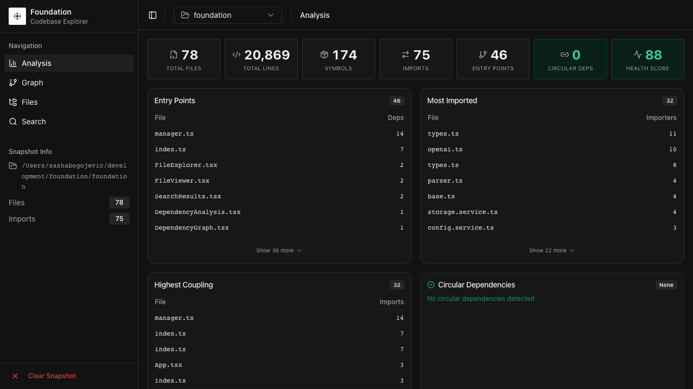
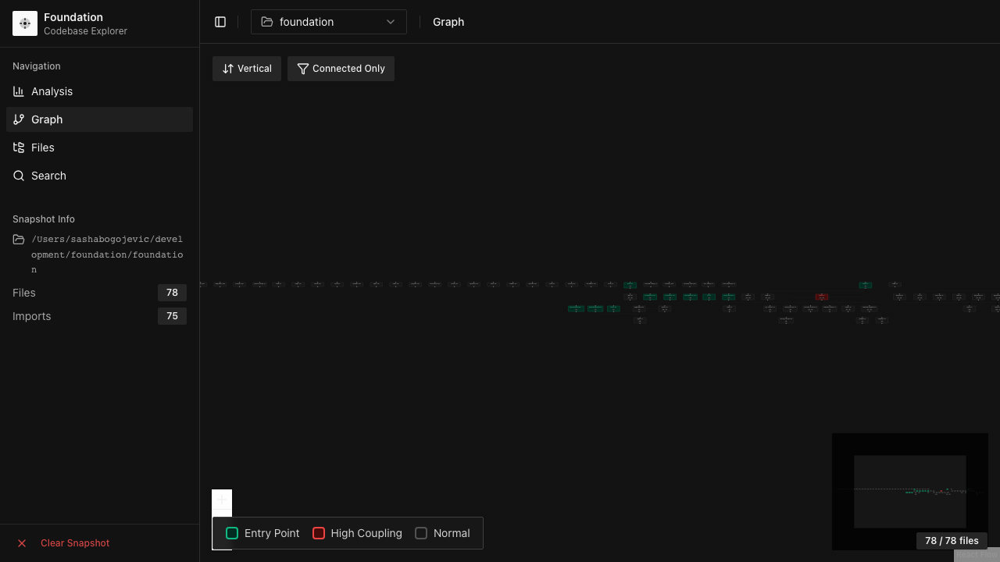

# Foundation Plugin

> *"The future is not set, but it can be guided."* -- Hari Seldon


**Codebase intelligence and semantic memory for Claude Code, inspired by Asimov's Foundation universe.**

---

## What is Foundation?

Foundation is a **Claude Code plugin** that gives your AI assistant persistent memory, deep codebase understanding, and automatic session lifecycle management. It is not an MCP server that dumps hundreds of tool definitions into your context window. It is a plugin -- hooks fire on lifecycle events at zero token cost, skills load instructions only when you invoke them, and only 5 essential MCP tools are registered.

The naming comes from Isaac Asimov's *Foundation* series. In the novels, Hari Seldon created the Foundation to preserve human knowledge through the collapse of the Galactic Empire -- a millennia-long dark age where everything would otherwise be forgotten. This plugin does the same thing for your development work: it preserves architectural decisions, codebase understanding, and project context across sessions, projects, and tools, so nothing is lost when a conversation ends or a context window resets.

Three core systems power the plugin:

- **Demerzel** -- the codebase watcher. Named after R. Daneel Olivaw (who also went by Eto Demerzel), the 20,000-year-old robot who quietly guided humanity from the shadows. Demerzel builds structural snapshots of your codebase -- import graphs, export maps, symbol indexes -- so Claude can answer architecture questions without reading every file.
- **Gaia** -- the local memory. Named after the planet with collective consciousness, where every organism shared a single mind. Gaia is a local SQLite + FTS5 database that connects sessions, projects, and insights through a unified knowledge graph with typed relationships.
- **Seldon** -- the orchestrator (Foundation v2). Named after Hari Seldon, the mathematician who created psychohistory -- a science that could predict the future of civilizations through statistical laws of mass behavior. In Foundation v2, Seldon was the multi-agent orchestration system: 12 tools that routed tasks to different LLM providers (OpenAI, Google, Ollama, etc.), compared multiple agent perspectives on the same problem, ran adversarial critiques, created phased implementation plans, and verified results in automated fix loops. Seldon had 6 agent roles (orchestrator, critic, coder, reviewer, researcher, verifier) and could route each to different models based on cost and capability. **In v3, Seldon was retired** -- Claude Code's native Task tool and parallel agent capabilities now handle multi-agent orchestration better than a custom layer could. The multi-provider routing remains available through the `/foundation:providers` skill.
- **Open Brain** -- the cloud semantic memory. Built on the [OB1 (Open Brain)](https://github.com/NateBJones-Projects/OB1) architecture by Nate Jones, this optional layer adds pgvector-powered semantic search via Supabase, so you can find memories by *meaning*, not just keywords.

---

## Quick Install

```bash
# Add the marketplace
claude plugin marketplace add sashabogi/foundation-plugin

# Install the plugin
claude plugin install foundation

# Restart Claude Code
```

That's it. No environment variables required for core functionality. Open Brain cloud memory is optional (see [setup below](#open-brain-setup-optional)).

---

## Core Systems

### Demerzel -- Codebase Intelligence

*"I have been watching for 20,000 years."*

Demerzel creates a structural understanding of your codebase without requiring Claude to read every file. When you generate a snapshot (via `/foundation:snapshot`), Demerzel walks your project tree, parses imports and exports, builds a symbol index, maps the dependency graph, and writes a compact representation to `.foundation/snapshot.txt`.

From that snapshot, Claude can:

- **Search by regex** across the entire codebase without reading files
- **Find where any symbol is exported** -- functions, classes, types, variables
- **Trace the import graph** -- who imports what, and what does each file depend on
- **Understand architecture** through AI-powered analysis using the Recursive Language Model (RLM) engine

The snapshot captures: file paths, line counts, import/export relationships, symbol locations, and the full dependency graph (both import graph and reverse export graph). Search operations against the snapshot are **free** -- they cost zero tokens beyond the results themselves.



#### Demerzel Tools

| Tool | Context Cost | What It Does |
|------|-------------|--------------|
| `demerzel_search` | FREE | Regex pattern search across the snapshot. Optionally filter by glob pattern. |
| `demerzel_find_symbol` | FREE | Find the file where a symbol (function, class, type, variable) is exported. |
| `demerzel_find_importers` | FREE | Find all files that import a given module. |
| `/foundation:snapshot` | ~500 tokens | Generate a new codebase snapshot with import/export graphs and symbol index. |

The search tools (`demerzel_search`, `demerzel_find_symbol`, `demerzel_find_importers`) are registered as MCP tools because they need to return structured data. The snapshot generation lives in a skill because it only needs to load instructions when invoked.

---

### Gaia -- Local Memory

*"We are all one, and one is all."*

Gaia is a local SQLite database with FTS5 full-text search, stored at `~/.foundation/gaia-memory.db`. It works completely offline with zero external dependencies and is backward-compatible with Foundation v2 databases.

#### 5-Tier Memory Hierarchy

| Tier | Persistence | Use Case |
|------|------------|----------|
| `session` | Ephemeral (current session only) | Scratch notes, temporary context |
| `project` | Cross-session, scoped to project | Architectural decisions, conventions, known issues |
| `global` | Cross-project | Personal preferences, reusable patterns, credential references |
| `note` | Permanent | Explicit notes the user wants to keep |
| `observation` | Auto-detected patterns | Patterns the system notices during sessions |

Each tier has a weight used in search scoring: session (1.0), project (0.8), global (0.6), note (0.4), observation (0.2).

#### Memory Link Graph

Memories can be linked with typed relationships:

| Link Type | Meaning |
|-----------|---------|
| `depends_on` | This memory requires another to make sense |
| `extends` | This memory builds on another |
| `reverts` | This memory reverses a previous decision |
| `contradicts` | This memory conflicts with another |
| `related` | General association |

Links are stored in a dedicated `memory_links` table with foreign keys and cascade deletes.

#### Composite Scoring

When you search Gaia, results are ranked by a composite score with five weighted factors:

| Factor | Weight | How It's Calculated |
|--------|--------|-------------------|
| BM25 relevance | 40% | FTS5 rank normalized to 0-1 |
| Recency | 25% | Exponential decay: `exp(-ageDays / 30)` |
| Tier weight | 15% | Tier scores from the hierarchy above |
| File proximity | 10% | 1.0 if the memory references the file you're currently editing, 0 otherwise |
| Access frequency | 10% | `min(1.0, access_count / 10)` -- frequently retrieved memories rank higher |

The FTS5 virtual table uses Porter stemming with Unicode61 tokenization, so searching "running" matches "run", "runs", and "runner".

#### Gaia Schema

```sql
CREATE TABLE memories (
  id TEXT PRIMARY KEY,
  tier TEXT NOT NULL CHECK(tier IN ('session','project','global','note','observation')),
  content TEXT NOT NULL,
  tags TEXT NOT NULL,           -- JSON array
  related_files TEXT NOT NULL,  -- JSON array
  session_id TEXT,
  project_path TEXT,
  created_at INTEGER NOT NULL,
  accessed_at INTEGER NOT NULL,
  access_count INTEGER NOT NULL DEFAULT 0,
  metadata TEXT                 -- JSON object
);

CREATE VIRTUAL TABLE memories_fts USING fts5(
  content, tags, related_files,
  content='memories',
  content_rowid='rowid',
  tokenize='porter unicode61'
);

CREATE TABLE memory_links (
  from_memory_id TEXT NOT NULL,
  to_memory_id TEXT NOT NULL,
  link_type TEXT NOT NULL CHECK(link_type IN ('depends_on','extends','reverts','related','contradicts')),
  created_at INTEGER NOT NULL,
  PRIMARY KEY (from_memory_id, to_memory_id, link_type),
  FOREIGN KEY (from_memory_id) REFERENCES memories(id) ON DELETE CASCADE,
  FOREIGN KEY (to_memory_id) REFERENCES memories(id) ON DELETE CASCADE
);
```

---

### Open Brain -- Cloud Semantic Memory

*Inspired by [OB1 (Open Brain)](https://github.com/NateBJones-Projects/OB1) by Nate Jones*

Open Brain is the optional cloud memory layer. While Gaia finds memories by keyword matching (FTS5), Open Brain finds them by **meaning** using pgvector embeddings in Supabase.

**What semantic search means in practice**: if you save a memory about "Sarah mentioned she's thinking about leaving the company," a keyword search for "career changes" would return nothing. A semantic search for "career changes" finds it immediately, because the vector embeddings understand the conceptual relationship.

Open Brain provides:

- **Vector embeddings** via OpenRouter (1536-dimensional vectors)
- **Auto-metadata extraction** via LLM: type classification, topic detection, people mentioned, action items, sentiment, importance scoring
- **Supabase Edge Function** for serverless embedding generation and search
- **Cross-tool accessibility** -- any MCP client can connect (Claude Desktop, ChatGPT, Cursor)

Open Brain communicates with the Supabase Edge Function using JSON-RPC over HTTPS. The Edge Function handles embedding generation, similarity search, and metadata extraction -- the plugin itself makes no direct LLM calls for embeddings.

**Open Brain is fully optional.** Gaia works completely on its own. Without Open Brain, you get fast local keyword search. With it, you add semantic understanding on top.

---

### Unified Memory Layer

Every memory operation goes through the unified memory interface (`src/memory/unified.mjs`), which coordinates both backends:

**Dual-write on save:**
1. Gaia receives the memory synchronously (local SQLite, always succeeds)
2. Open Brain receives it asynchronously (cloud, best-effort, non-blocking)
3. If Open Brain is unconfigured or unreachable, the save still succeeds via Gaia

**Dual-read on search:**
1. Gaia returns FTS5 keyword matches with composite scoring
2. Open Brain returns pgvector semantic matches with similarity scoring
3. Results are merged, deduplicated by content similarity, and ranked by combined score

The result set includes a `source` field (`gaia` or `openbrain`) so you can see where each match came from, plus counts from each backend.

---

## Skills Reference

Skills are slash commands that load their instructions into context only when invoked. They consume **zero tokens** when not in use.

| Skill | Command | What It Does |
|-------|---------|-------------|
| Snapshot | `/foundation:snapshot` | Generate a Demerzel codebase snapshot with import/export graphs, symbol index, and dependency mapping. Saves to `.foundation/snapshot.txt`. |
| Remember | `/foundation:remember` | Save a memory to both Gaia (local) and Open Brain (cloud). Prompts for tier selection and tags. |
| Recall | `/foundation:recall` | Search memories across both keyword (FTS5) and semantic (pgvector) indexes. Results merged and ranked. |
| Handoff | `/foundation:handoff` | Create a session handoff document capturing decisions, file changes, blockers, and next steps. The next session auto-loads it. |
| Providers | `/foundation:providers` | List and test configured LLM providers, their health status, and routing rules. |
| Brain Stats | `/foundation:brain-stats` | Show unified memory statistics: total memories, tier breakdown, top topics, storage health. |
| Foundation UI | `/foundation:foundation-ui` | Launch the Foundation web dashboard at `http://localhost:3333`. |

---

## Hooks (Automatic Lifecycle)

Hooks fire automatically on Claude Code lifecycle events. The user never invokes these -- they run in the background with no token cost until triggered.

| Hook | When It Fires | What It Does |
|------|--------------|-------------|
| **SessionStart** | When a Claude Code session begins | Checks for `.foundation/snapshot.txt` in the project directory. If found, injects a system reminder telling Claude that Demerzel tools are available for codebase queries, avoiding unnecessary file reads. |
| **PreToolUse** | Before any tool call | Intercepts tool invocations. Can inject additional context, suggest Foundation tools when Claude is about to read many files, and route queries through Demerzel when appropriate. |
| **PostToolUse** | After any tool call completes | Observes tool results. Can auto-capture architectural decisions, track file changes for session checkpoints, and detect repeated patterns that suggest optimization opportunities. |
| **SessionEnd** | When a Claude Code session ends | Auto-checkpoints session state to Gaia -- decisions made, files changed, tasks in progress -- so the next session can pick up where this one left off. |

All hooks read JSON from stdin, write debug logs to stderr, and output `hookSpecificOutput` JSON to stdout. They are designed to execute in under 20ms with no network calls and no LLM invocations.

---

## Foundation UI -- Dashboard

The Foundation web dashboard runs locally at `http://localhost:3333`. Launch it with `/foundation:foundation-ui` or by running `foundation ui` from the CLI.

The dashboard provides:

- **Analysis view** -- Codebase overview with file counts, import/export statistics, and dependency tables


- **Dependency graph** -- Interactive XYFlow visualization showing file relationships. Entry points are highlighted in green, highly-coupled files in red, and normal files in gray.



---

## Open Brain Setup (Optional)

Open Brain requires a Supabase project and an OpenRouter API key for embedding generation. The free tier of both services is sufficient.

### Step 1: Create a Supabase Project

Go to [supabase.com](https://supabase.com) and create a new project. Note your project URL and anon key.

### Step 2: Enable pgvector and Create the Schema

Run this SQL in the Supabase SQL Editor:

```sql
-- Enable the pgvector extension
create extension if not exists vector with schema extensions;

-- Create the thoughts table
create table thoughts (
  id uuid primary key default gen_random_uuid(),
  content text not null,
  embedding extensions.vector(1536),
  type text,                          -- auto-classified: idea, decision, observation, question, plan, reflection
  topics text[] default '{}',         -- auto-extracted topic tags
  people text[] default '{}',         -- auto-extracted people mentioned
  action_items text[] default '{}',   -- auto-extracted action items
  sentiment text,                     -- auto-detected: positive, negative, neutral, mixed
  importance integer default 5,       -- auto-scored 1-10
  source text default 'unknown',      -- where the thought came from
  metadata jsonb default '{}',        -- arbitrary structured data
  created_at timestamptz default now(),
  updated_at timestamptz default now()
);

-- Create the IVFFlat index for fast similarity search
create index on thoughts
  using ivfflat (embedding extensions.vector_cosine_ops)
  with (lists = 100);

-- Index for filtering by type and topics
create index idx_thoughts_type on thoughts(type);
create index idx_thoughts_created on thoughts(created_at desc);

-- Enable Row Level Security (recommended)
alter table thoughts enable row level security;

-- Create a policy for authenticated access
create policy "Allow all access via service key"
  on thoughts for all
  using (true)
  with check (true);
```

### Step 3: Deploy the Edge Function

Deploy the Open Brain Edge Function to your Supabase project. The function handles:
- Embedding generation via OpenRouter (text-embedding-3-small, 1536 dimensions)
- Semantic similarity search using pgvector cosine distance
- Auto-metadata extraction (type, topics, people, action items, sentiment, importance)
- JSON-RPC interface compatible with MCP tool calling

### Step 4: Get an OpenRouter API Key

Sign up at [openrouter.ai](https://openrouter.ai) and create an API key. The Edge Function uses this for embedding generation. Cost is approximately $0.02 per 1M tokens -- typical usage is under $5/month.

### Step 5: Set Environment Variables

```bash
export OPEN_BRAIN_URL="https://your-project.supabase.co/functions/v1/open-brain"
export OPEN_BRAIN_KEY="your-authentication-key"
```

Add these to your shell profile (`~/.zshrc`, `~/.bashrc`) or Claude Code's environment configuration.

---

## Architecture

```
foundation-plugin/
├── .claude-plugin/
│   └── plugin.json              # Plugin manifest: name, version, MCP server config, skills path
├── hooks/
│   ├── sessionstart.mjs         # Loads snapshot context on session start
│   ├── pretooluse.mjs           # Intercepts tool calls for context injection
│   ├── posttooluse.mjs          # Observes results for auto-capture
│   └── sessionend.mjs           # Checkpoints session state on exit
├── skills/
│   ├── snapshot/SKILL.md        # /foundation:snapshot
│   ├── remember/SKILL.md        # /foundation:remember
│   ├── recall/SKILL.md          # /foundation:recall
│   ├── handoff/SKILL.md         # /foundation:handoff
│   ├── providers/SKILL.md       # /foundation:providers
│   ├── brain-stats/SKILL.md     # /foundation:brain-stats
│   └── foundation-ui/SKILL.md   # /foundation:foundation-ui
├── src/
│   ├── demerzel/
│   │   ├── index.mjs            # Demerzel public API (re-exports)
│   │   ├── search.mjs           # Regex search, symbol lookup, import graph queries
│   │   ├── snapshot.mjs         # Snapshot generator: file walker, import/export parser, graph builder
│   │   └── analyze.mjs          # AI-powered analysis using RLM engine and Nucleus DSL
│   ├── memory/
│   │   ├── gaia.mjs             # Local SQLite + FTS5 storage, BM25 scoring, link graph
│   │   ├── openbrain.mjs        # Cloud Supabase + pgvector client (JSON-RPC transport)
│   │   └── unified.mjs          # Dual-write coordinator, search merger, deduplication
│   └── server.mjs               # MCP server: 5 tools via @modelcontextprotocol/sdk
├── assets/
│   ├── banner.jpg               # README banner image
│   ├── ui-analysis.png          # Dashboard analysis view screenshot
│   ├── ui-graph.png             # Dashboard dependency graph screenshot
│   └── ...                      # Additional UI screenshots
├── start.mjs                    # Entry point: dependency check, graceful shutdown, server boot
├── package.json                 # Dependencies: better-sqlite3, @modelcontextprotocol/sdk, zod
└── marketplace.json             # Plugin marketplace metadata
```

**Why a plugin instead of an MCP server?** Traditional MCP servers register all their tools at connection time. Every tool description is loaded into the context window of every session, whether you use it or not. Foundation v2 had 37 tools -- that's roughly 13,000 tokens consumed just by tool definitions sitting in context. Multiply that across multiple MCP servers and you're burning 50-75K tokens before the conversation even starts.

Foundation v3 solves this with the Claude Code plugin architecture:
- **Hooks** fire on lifecycle events and cost zero tokens until triggered
- **Skills** are slash commands that load instructions only when invoked
- **Only 5 MCP tools** remain (the ones that must return structured data to Claude)

---

## From Foundation v2 to v3

Foundation v2 was a monolithic MCP server with 37 tools across three subsystems (Demerzel, Gaia, Seldon). Foundation v3 is a plugin that achieves the same capabilities with dramatically lower context cost.

| What Changed | v2 | v3 |
|-------------|----|----|
| Architecture | MCP server (37 tools) | Plugin (5 tools + 7 skills + 4 hooks) |
| Context cost at idle | ~13,000 tokens | ~0 tokens (tools load on demand) |
| Demerzel (codebase) | 9 MCP tools | 3 MCP tools + 1 skill |
| Gaia (memory) | 16 MCP tools | 2 MCP tools + 4 skills |
| Seldon (multi-agent) | 12 MCP tools | Removed -- replaced by Claude Code's native Task tool |
| Session lifecycle | Manual | Automatic via hooks |
| Cloud memory | Not included | Open Brain integrated (from OB1) |

**What was kept:** Demerzel's codebase intelligence, Gaia's local memory with FTS5, the multi-project web dashboard.

**What was merged in:** Open Brain cloud semantic memory, adapted from [OB1](https://github.com/NateBJones-Projects/OB1)'s Supabase + pgvector architecture.

**What was trimmed:** Seldon's 12 multi-agent orchestration tools (`seldon_invoke`, `seldon_compare`, `seldon_critique`, `seldon_review`, `seldon_plan`, `seldon_phase_create`, `seldon_phase_list`, `seldon_verify`, `seldon_fix`, `seldon_execute_verified`, `seldon_providers_list`, `seldon_providers_test`). Seldon routed tasks to 6 agent roles (orchestrator, critic, coder, reviewer, researcher, verifier) across multiple LLM providers, ran adversarial reviews, built phased implementation plans, and executed verification loops. Claude Code now handles all of this natively -- the Task tool dispatches subagents, parallel agent teams run concurrent work, and the model itself handles planning and critique. Keeping Seldon would have meant maintaining 12 tools that duplicate what Claude Code does out of the box. The multi-provider configuration (`~/.foundation/config.yaml`) still exists for use through the `/foundation:providers` skill.

**Net result:** 37 MCP tools reduced to 5, with the same feature set delivered through skills and hooks. Approximately 10,000+ tokens freed per session.

---

## Environment Variables

| Variable | Required | Default | Description |
|----------|----------|---------|-------------|
| `OPEN_BRAIN_URL` | For cloud memory | None | Supabase Edge Function URL for embedding generation and semantic search (e.g., `https://your-project.supabase.co/functions/v1/open-brain`) |
| `OPEN_BRAIN_KEY` | For cloud memory | None | Authentication key for the Open Brain endpoint |
| `CLAUDE_PROJECT_DIR` | No | Auto-set by Claude Code | Working directory for the current project. Set automatically. |

---

## Acknowledgments

- **Isaac Asimov's Foundation series** for the naming, philosophy, and the idea that knowledge can be preserved through chaos if you build the right systems.
- **[OB1 (Open Brain)](https://github.com/NateBJones-Projects/OB1)** by Nate Jones -- the semantic memory architecture that Foundation's cloud layer is built on. The Supabase Edge Function pattern, pgvector embeddings, and auto-metadata extraction approach all originate from OB1.
- **[Context-Mode](https://github.com/mksglu/context-mode)** by mksglu -- the plugin architecture pattern (plugin.json, hooks, SKILL.md) that Foundation v3 follows. Context-Mode proved that plugins with hooks are far more efficient than MCP servers for AI-assisted development.
- **Claude Code team** at Anthropic for the plugin system, hook lifecycle, and skill architecture that makes this approach possible.

---

## License

MIT
